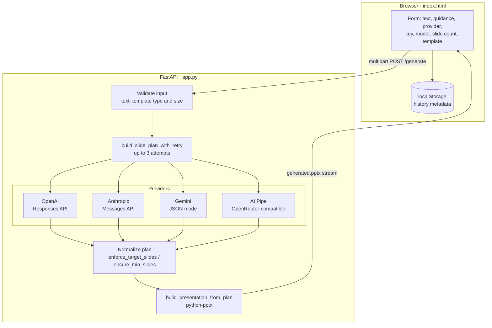

# DeckSmith AI

Turn long-form text, Markdown or reports into a styled PowerPoint deck. Bring your own template and your own LLM key.

**Live:** [tds-ppt-generator-gray.vercel.app](https://tds-ppt-generator-gray.vercel.app)

> **In one line:** paste your content, optionally upload a `.pptx` or `.potx` template, pick OpenAI, Anthropic, Gemini or AI Pipe, and download a ready-to-present deck in your template's fonts, colours and layouts.

---

## Table of contents

1. [Why this exists](#why-this-exists)
2. [Features](#features)
3. [Architecture](#architecture)
4. [How generation works](#how-generation-works)
5. [Project structure](#project-structure)
6. [Tech stack](#tech-stack)
7. [Getting started](#getting-started)
8. [Using the web app](#using-the-web-app)
9. [API reference](#api-reference)
10. [Limits and defaults](#limits-and-defaults)
11. [Error handling](#error-handling)
12. [Design decisions](#design-decisions)
13. [Privacy](#privacy)
14. [Known limitations](#known-limitations)
15. [Roadmap](#roadmap)

---

## Why this exists

Turning a document into slides is slow, repetitive work: deciding where to split, writing slide titles, condensing paragraphs into bullets, and then fixing the formatting so it matches the company template. LLMs are good at the first three and bad at the last one, because they can't reliably produce a valid PowerPoint file.

DeckSmith splits the job accordingly. **The LLM decides the content and structure; deterministic code renders it into your template.**

---

## Features

**Input**
- Paste up to **60,000 characters** of prose, notes, Markdown or report text.
- Add a one-line **guidance** prompt to steer tone and structure, e.g. *"investor pitch"* or *"technical summary for engineers"*.
- Choose an **exact slide count (1–40)**, or let the model decide (minimum 10).

**Providers (bring your own key)**
- **OpenAI** (Responses API, default `gpt-4o-mini`)
- **Anthropic** Claude
- **Google Gemini** (default `gemini-2.5-flash`, with native JSON output mode)
- **AI Pipe** (OpenRouter-compatible proxy)
- Override the model name for any provider.

**Templates**
- Upload a **`.pptx` or `.potx`** template (up to 30 MB). The output inherits its slide masters, layouts, theme fonts and colours.
- Optional **image reuse**: pictures from each template slide are copied onto the matching generated slide, and repositioned automatically if they would cover text.
- No template? A clean default deck is generated.

**Web app**
- Single-page UI with light and dark themes.
- **Local history** of generations (metadata only), with export and clear.
- Re-download the last deck, toast notifications, and a request-time and call-count panel.
- Live form validation: the Generate button only enables once the required fields are filled.

---

## Architecture



---

## How generation works

### Step 1: Plan the deck (LLM)

The text and guidance are wrapped in a strict planning prompt:

```text
You are a slide planner. Return JSON ONLY (no code fences, no Markdown),
mapping the user's text into slides.

Constraints:
- Choose exactly {N} slides (if content is short, expand; if long, summarize).
  (or: Choose a reasonable number of slides (min 10, max 40))
- Title ≤ 80 chars
- 3–6 bullets per slide, each ≤ 120 chars
- No images or tables in output
- Omit 'notes' unless essential.

Bias structure & tone toward: "{guidance}"
```

The expected output is a small, predictable structure:

```json
{
  "slides": [
    { "title": "A short slide title", "bullets": ["point 1", "point 2", "point 3"] }
  ]
}
```

Each provider is called in the way that gives the most reliable JSON:

| Provider | How it's called | JSON safeguard |
| --- | --- | --- |
| OpenAI | `client.responses.create`, temperature 0.2 | Robust text extraction across SDK response shapes, then parsing |
| Anthropic | `messages.create`, temperature 0.2, `max_tokens` 2048 | System prompt: *"Return ONLY valid JSON. No explanations. No code fences."* |
| Gemini | `models.generate_content` | `response_mime_type: application/json` (native JSON mode) |
| AI Pipe | Direct HTTPS call to the OpenRouter-compatible endpoint | If the reply isn't JSON, it's wrapped into a single slide rather than failing |

Parsing is defensive: if `json.loads` fails, the first `{ ... }` block in the reply is extracted and parsed. If the result still has no `slides` list, the attempt counts as failed. Failed attempts are retried **up to two more times**, with backoff of 0.8 s and then 1.6 s.

### Step 2: Normalize the plan

LLMs rarely hit an exact slide count, so the plan is corrected in code:

- **Too few slides:** slides with more than 3 bullets are split into `"Title (cont.)"` slides of up to 3 bullets each. If that's still not enough, title-only slides pad the deck to the target.
- **Too many slides:** adjacent continuation slides are merged (capped at 8 bullets), and anything beyond the target is trimmed.
- **No target given:** the deck is brought up to at least 10 slides using the same splitting rules.
- Every title is trimmed (max 120 characters on the slide), and empty bullets are dropped (max 10 per slide).

### Step 3: Render into the template

`build_presentation_from_plan` does the following:

1. Opens the template, or a blank presentation if none was uploaded.
2. If image reuse is on, **records every picture** on every template slide (image bytes plus position and size) before anything is deleted.
3. **Removes all existing slides safely**, dropping each slide's relationship as well as its ID so PowerPoint doesn't flag the file as corrupt.
4. Finds a layout with both a **title and a body placeholder** (types 1 and 2/7), falling back to layout index 1 or 0.
5. For each planned slide:
   - collects every text area on the slide (title, body, subtitle, content placeholders and text boxes);
   - **inserts reused images first**, so text is layered on top;
   - moves and scales any image that overlaps a text area by more than 10% into free space;
   - fills the title, then writes bullets into the body placeholder (or a text box if the layout has none).
6. Saves the deck to memory and streams it back as `generated.pptx`.

---

## Project structure

```text
decksmith-ai/
├── app.py            # FastAPI app: routes, LLM providers, plan normalization, PPTX builder
├── index.html        # Single-page frontend (vanilla HTML/CSS/JS)
├── favicon.ico
├── requirements.txt
├── vercel.json       # Vercel Python deployment config
└── LICENSE           # MIT
```

---

## Tech stack

| Layer | Technology |
| --- | --- |
| Backend | Python, **FastAPI**, Uvicorn |
| PowerPoint generation | **python-pptx** |
| LLM SDKs | `openai`, `anthropic`, `google-genai`, plus `requests` for AI Pipe |
| Frontend | Vanilla HTML, CSS and JavaScript, Font Awesome icons |
| Hosting | **Vercel** (`@vercel/python`) |

---

## Getting started

### Prerequisites

- Python 3.10+
- An API key from at least one provider: OpenAI, Anthropic, Google AI Studio (Gemini) or AI Pipe

### Run locally

```bash
git clone https://github.com/Riddhim-r/decksmith-ai.git
cd decksmith-ai
python -m venv venv && source venv/bin/activate   # Windows: venv\Scripts\activate
pip install -r requirements.txt
uvicorn app:app --reload
```

Open **http://localhost:8000**. FastAPI serves `index.html` at `/`, so there's no separate frontend build.

### Deploy to Vercel

The repo includes `vercel.json`, which routes all requests to `app.py`. Import the repo into Vercel and deploy; no environment variables are needed, since users supply their own keys.

---

## Using the web app

1. **Paste your content** into the main text area.
2. *(Optional)* Add **guidance**, e.g. *"make it an investor pitch deck"*.
3. Choose a **provider** and paste your **API key**. Optionally set a model name.
4. *(Optional)* Set the **number of slides**.
5. *(Optional)* Upload a **template**, and tick **reuse images** to carry over its pictures.
6. Click **Generate**. The deck downloads automatically, and the entry appears in your local history.

---

## API reference

### `POST /generate`

`multipart/form-data`

| Field | Type | Required | Description |
| --- | --- | --- | --- |
| `text` | string | ✅ | Source content (truncated to 60,000 characters) |
| `provider` | string | ✅ | `openai`, `anthropic`, `gemini` or `aipipe` |
| `api_key` | string | ✅ | Provider key; used for this request only |
| `model` | string | — | Overrides the provider's default model |
| `guidance` | string | — | One-line steer for tone and structure |
| `num_slides` | integer | — | Exact slide count, clamped to 1–40 |
| `reuse_images` | boolean | — | Copy template pictures onto generated slides (default `false`) |
| `template` | file | — | `.pptx` or `.potx`, 1 KB–30 MB |

**Example**

```bash
curl -X POST http://localhost:8000/generate \
  -F "text=<report.md" \
  -F "provider=gemini" \
  -F "api_key=$GEMINI_API_KEY" \
  -F "num_slides=12" \
  -F "guidance=executive summary for leadership" \
  -F "template=@company_template.pptx" \
  -o deck.pptx
```

**Response:** `200` with `Content-Type: application/vnd.openxmlformats-officedocument.presentationml.presentation`, `Content-Disposition: attachment; filename="generated.pptx"` and `Cache-Control: no-store`.

### Other routes

| Route | Purpose |
| --- | --- |
| `GET /` | Serves the web app |
| `GET /favicon.ico` | Serves the icon, or a 1×1 transparent PNG so browsers don't log 404s |
| `GET /docs` | FastAPI's auto-generated Swagger UI |

---

## Limits and defaults

| Setting | Value |
| --- | --- |
| Max input text | 60,000 characters |
| Slide count | 1–40 (exact), or at least 10 when unspecified |
| Template size | 1 KB minimum, 30 MB maximum |
| Template formats | `.pptx`, `.potx` |
| Bullets per slide (rendered) | Up to 10 |
| LLM attempts | 3 (1 + 2 retries) |
| Default models | OpenAI and AI Pipe: `gpt-4o-mini` · Gemini: `gemini-2.5-flash` · Anthropic: set in `app.py` |

---

## Error handling

| Status | When |
| --- | --- |
| `400` | Empty text, wrong template extension, template too small or too large, or an unsupported provider |
| `500` | `LLM error: ...` after all retries fail (bad key, model not available, or unparseable output) |
| `500` | `PowerPoint build error: ...` if the template can't be processed |

The frontend shows each error as a toast with the server's message.

---

## Design decisions

**1. Separate planning from rendering.**
The LLM only produces a small JSON plan of titles and bullets. Everything visual is done by deterministic `python-pptx` code. As a result, any provider can be swapped in, a bad model response can never produce a corrupt `.pptx`, and the rendering logic can be tested without calling an LLM.

**2. Use each provider's strongest JSON mechanism.**
Gemini gets native JSON mode, Claude gets a JSON-only system prompt, and every reply goes through the same defensive parser and schema check. Low temperature (0.2) keeps the structure consistent.

**3. Correct the slide count in code, not in the prompt.**
Prompts make the count *likely*; code makes it *guaranteed*. Splitting dense slides and merging continuations keeps decks readable instead of simply truncating content.

**4. Images never cover text.**
Template images are added before text so text stays on top. Any image overlapping a text zone by more than 10% of its area is moved into free space (right of the body, then below it, then left of it) and scaled to fit while keeping its aspect ratio.

**5. Remove template slides cleanly.**
Deleting a slide's ID without also dropping its relationship leaves orphaned parts, which makes PowerPoint show a "repair" prompt. Both are removed together, so real company templates open without errors.

**6. Bring your own key.**
No server-side keys means no shared cost, no quota to manage and nothing secret stored on the server.

---

## Privacy

- **The server stores nothing.** Text, keys and templates are processed in memory for one request and never written to disk or logged, and the response is marked `no-store`.
- **Browser history** keeps only metadata about past generations, never files or deck content.
- Note: the frontend currently remembers the **first 32 characters of your API key** in `localStorage` for convenience. On shared machines, clear this site's data in your browser settings. *(Planned: remove this.)*

---

## Known limitations

- Retry backoff uses `time.sleep` inside an async route, which blocks the worker while waiting.
- Image reuse maps template slide *n* to generated slide *n*; extra generated slides get no images.
- The AI Pipe path uses temperature 0.7 and a fixed `max_tokens` of 1000, so very long decks may get cut off.
- Text is placed with the layout's default formatting; there's no automatic font shrinking for long bullets.

---

## Roadmap

- [ ] Stop storing any part of the API key in the browser.
- [ ] Speaker notes generated alongside each slide.
- [ ] Slide preview before download.
- [ ] Prebuilt guidance presets (sales deck, research summary, lecture).
- [ ] Async retries and proper per-request timeouts.
- [ ] Tables and charts from structured data in the source text.

---

## License

MIT, see [LICENSE](LICENSE).

## Author

**Riddhim Rathor** · [LinkedIn](https://linkedin.com/in/riddhim-rathor) · [Portfolio](https://riddhim-spotted-on.vercel.app/) · [GitHub](https://github.com/Riddhim-r)
